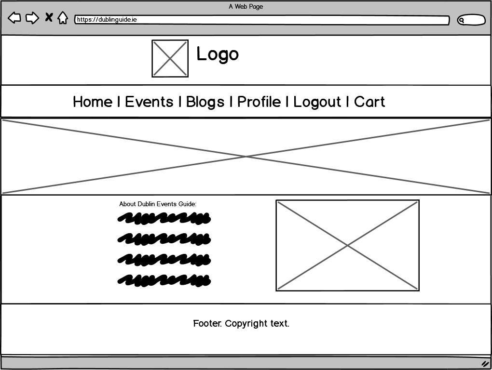
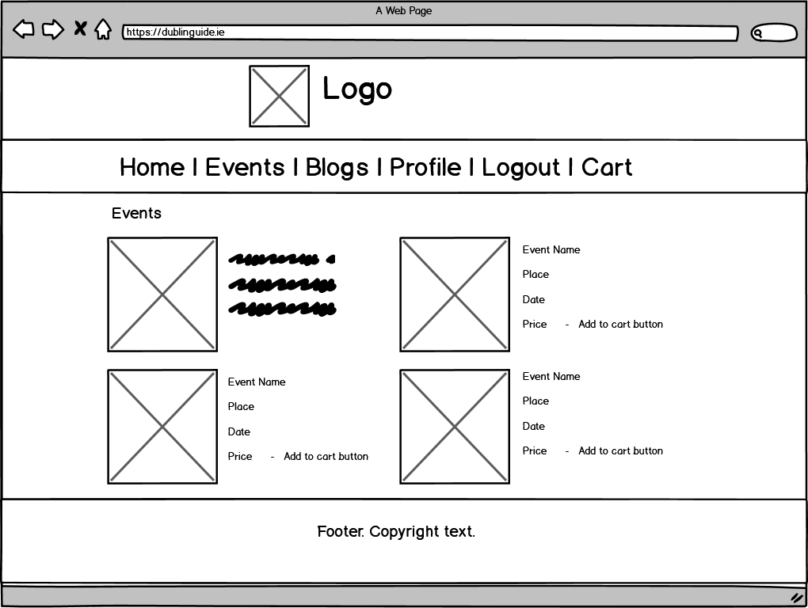
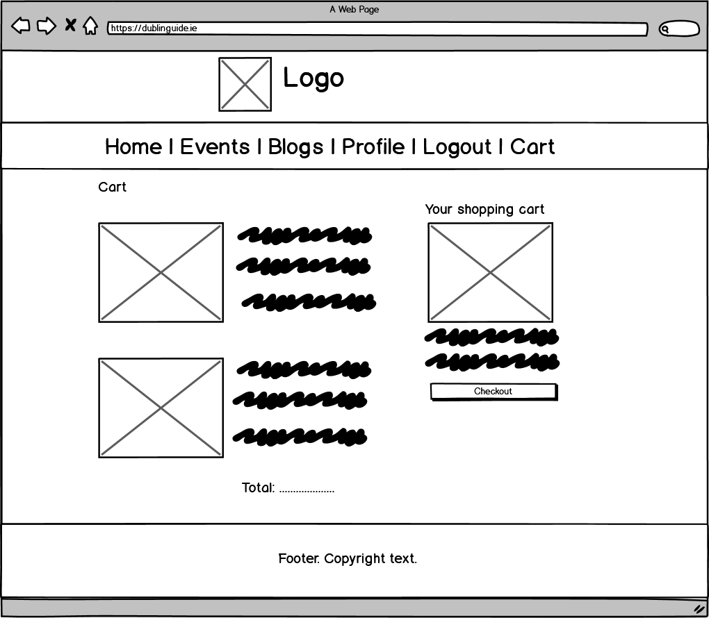
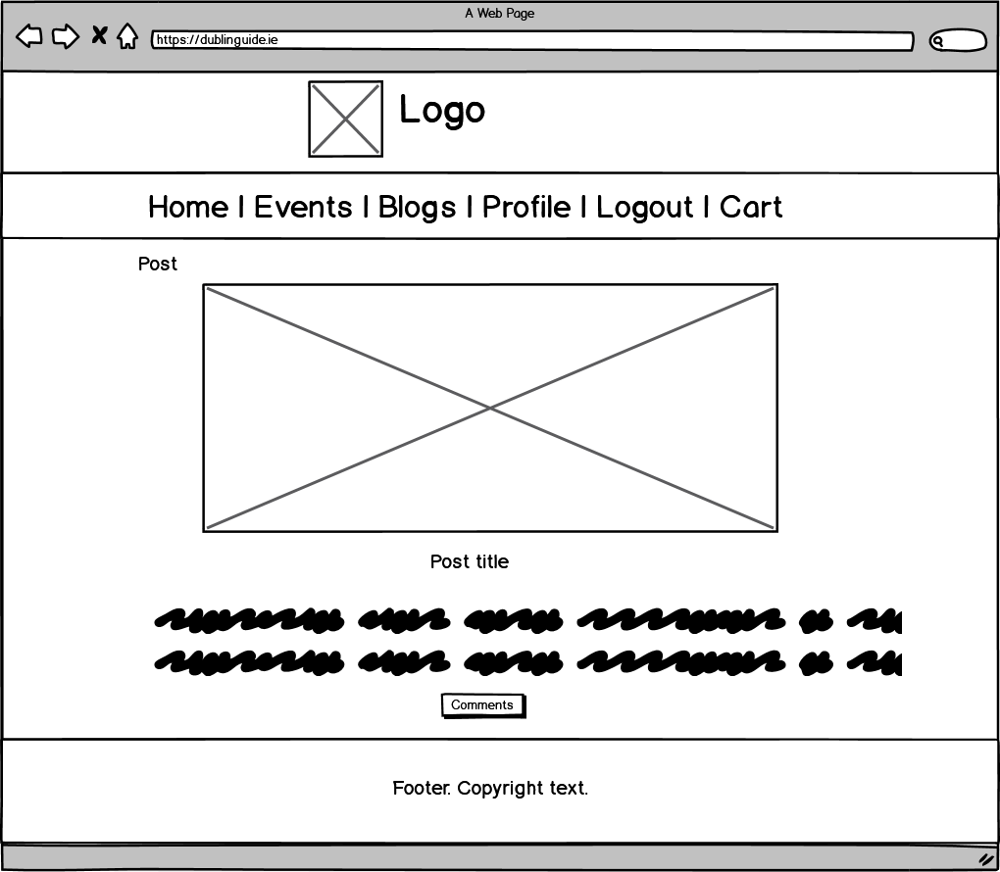
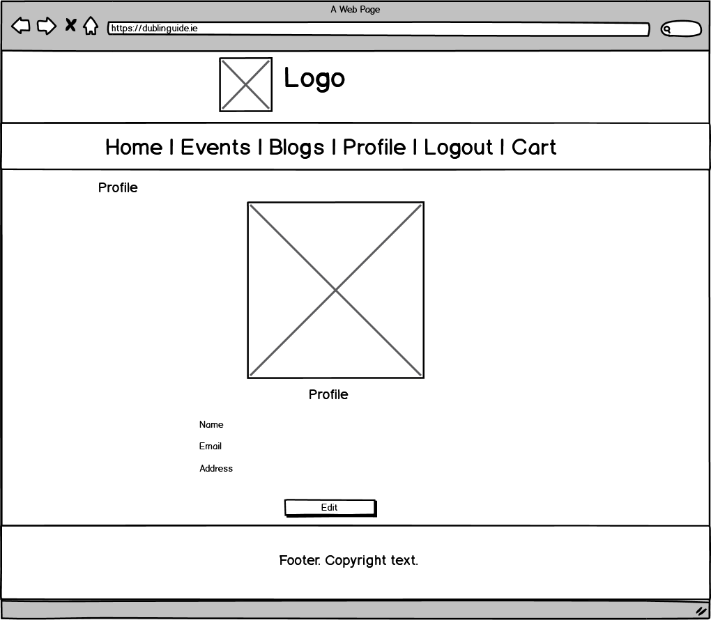

# Dublin Events Guide

### Aim and the basis of the project Dublin guide
Failte Ireland's research back in 2018 showed that the tourist flow to Ireland grew by 6.5% in 2018 to 9.6 million, and their expenditure amounted to a stunning 5.6billion. The absolute majority(69%) of those tourists came to Dublin by this estimate, spending almost 2.2billion. The same research discovered that most of those tourists relied on information found on two principal sources: books and guides, and the internet. These numbers alone inspired me to start the Dublin guide project as part of my final project with Code Institute. I understand that there is still a lack of useful one-stop resources for guests coming to Dublin as all information is scattered all over the internet. Therefore I decided that I will base my project on this particular issue.
This project has multiple aims depending on the angle that we take. 
### Regular visitor stories
For a regular visitor from the internet (random user), the website should provide:
* Easy and comprehensive list of venues and events that are happening in Dublin;
* Descriptions of the most popular and not so well known tourist locations;
* Links and information about the tours and excursions within Dublin and outside of Dublin;
* A series of blog posts that would allow them to get familiarized with Dublin and the local life.

I considered the following stories:

User 1 is coming from Great Britain for two night weekend. He is the first time in Dublin, and all he knows is Temple Bar, and it's pubs that are currently closed. He wants to plan his trip and get all the necessary tickets by internet:

Acceptance criteria: build a list of events that can be sorted by venue place and price and date were tickets can be purchased.

User2 is coming from Galway to Dublin to work for two weeks. He knows Dublin and only wants to feel the local spirit of the community. 

Acceptance criteria1: build a blog that describes Dublin's various parts, reports of past events that the Galway lad could later discuss with local people

Acceptance criteria2: make the events list with the purchasing functionality that the Galway lad could buy the tickets to the events in advance and have a fun time after work.
## Business owner stories
For the business benefiting from the stream of tourists, this website would provide the following:
* A great place to advertise free venues;
* A great place to sell tickets to the paid sites and events;
* The Perfect source of leads for their tour businesses;
* A great way to showcase their businesses by guest blogging;
* A platform for advertising on various blog posts.

I considered the following story:

User3 is a tour operator who is looking for new leads for his bus trips around Dublin. 
Acceptance criteria3: The business owner contacts the owner of the website and agrees to list his trip to the event guide and sell his tour tickets there. The site owner gets a small commission for every ticket sold.
## Site owner stories:
A site owner primarily benefits by earning his extra or a full-time income by managing the project. For him, this project provides:
* A tool to publish and showcase events, venues, places and tours that you can find in Dublin;
* A stream of royalties from the sales of event tickets;
* An income stream from the paid advertising;
* A profit share from the tour organizations. 
### Project Creator:
This project is a **Full Stack Frameworks with Django Milestone Project** part of my study in Full Stack Software Development at Code Institute. The goal is to build a project that has a Django backend connected to a relational database and to create a website that allows users to store and manipulate data records through a CMS powered by Django. My goal was to build a one-stop e-commerce shop for all events and venues in Dublin with a blog and a ticket shopping functionality.
 
### UX
#### User expectation
The website's random user needs to feel this website can provide answers to all of his questions and a comprehensive solution to plan his trip from A to Z, including the ability to purchase tickets to the events.  The business owner needs to feel that this website is a good source of quality leads. He also needs to know that the user experience is excellent and that his business reputation would not suffer from being featured on low-quality partner websites.

Meeting user expectations

There are three ways that I try to meet the user's expectations:

1. Clear easy to use and understand website layout and structure
2. Beautiful and user-friendly design
3. Certain features that enhance trust and experience

I will describe all three in more detail. 

#### Layout and structure.
The website has a simple, easy to understand layout and structure based on a Mobile-first approach.  There are three main sections: the header, the main container, and the footer section. The header section features a logo and a fixed navigation to enhance user experience.
The navigation bar turns into a burger menu when the screen gets reduced in size. Based on the authentication of the user, the links can vary. If the a hasn't logged in "Login" and "Register" links are displayed. After the user logs in, then "Profile" and "Logout" links are shown in the navbar. The website has it's cart link displayed in all cases.  I indented the footer to the left of the page. This footer features a link to contact us page, a set of social media icons, and a business location. 
The main content of the home page features a large slide with a photo taken at one of the St Patrick's festivals. 
The events page features the events listed in a block manner, and two sorting buttons are present. The sort and filtering add to good user experience. Thinking about the user, I introduced sorting by price, location, and the date of the event. 
Each of the events listings have a broad picture, and the primary descriptive information featured: Location of the venue, date and the ticket cost (or if there is no cost, I display it as a free event). It also has a link to more information (that leads to the dedicated page to that event) and a buy button that lets the user instantly purchase the ticket. 
 Having the primary details in one place enables users to feel secure and encourages their trust in the website's legitimacy. It also communicates the e-commerce nature of each of the listings. 
The layout of an event description page is sleek, featuring a bunch of photos displayed as a slide ribbon and a description underneath.  
Such layout is very convenient for users as it doesn't overwhelm them with too much information and a neverending stream of pictures. 
The blog page features all blogs displayed in a grid format. Each cell has its picture, a brief description of the blog post, and a link to read more. A lovely feature that I implemented to enhance the user experience of the blog page is the overall count of views and the comments that each blog post has achieved. 
The shopping cart page provides a clear and transparent view of all items added and the total payable amount. The number of purchases in the cart is displayed in the navbar as the cart icon will display a number (if not zero.)
#### Design
The emotional impact of interface colors and fonts is significant in any project as they have a massive effect on a **user's** perception. I tried creating a friendly, open, and transparent feel with the colors I selected. Therefore the primary colors I decided to incorporate are:
white- to communicate the transparency of the website;
Warm grey - rgb(52,58,64) - to demonstrate professionalism and trustworthiness;
Warm Yellow - rgb(255,193,7) - to provide a friendly and warm feel. 
The fonts are also critical when designing a project. Therefore I decided to go with clean and open Lato from the Serif family of fonts. With the color scheme and fonts, I think I achieved what I wanted - an airy, warm, and welcoming feel of the website that can be trusted by all of its users.
#### Features
the tiny features are significant enhancers to user experience. They say that the devil is in details. The simple already mentioned things like the count of comments and views on blog posts, easy to click shopping interface, the image slider and the easy to understand pagination are the main features that add to the user experience of Dublin guide. I implemented the following features that enhance user experience :
* A logo that takes back to the home page when clicked;
* A sticky navbar that lets users easily switch between pages without scrolling back to the top;
* Shopping cart showing the number of items added;
* Highlighting the menu items when hovering over them;
* Filtering events by location and Sorting them by price and date;
* Buttons that link back to the previous page on every page;
* The publishing date and time of the blog posts;
* A text box for commenting on blog posts;
* The possibility for a logged-in user to update their information;
* Contact form for easy communication with the website owner.

#### Functionality
From the functionality point of view, the website consists of 3 main areas:
* Admin
* Authorized user (registered and logged in user)
* Unauthorized user (a random visitor)
#### Admin area
Inside the Admin area, I fully implemented the full CRUD functionality to affect and manipulate data in the database. 
Admin has the following functions:
* Create, update and delete blog posts, add the blog images
* Add new events, set and reset their prices, add pictures and descriptions
* Create, update and delete users, see the list of users
* See user information such as login names and salted passwords
* Check sales information 
* Approve comments on blog posts, read messages.
#### User area
There are two types of users: logged in users (authorized) and users who have not logged in or not registered (unauthorized). They have very similar functionality; however, the registered and logged in users can do more. 

Basic functionality that is available to both types of users:

* Read comments on blogs;
* Read about the events and add them to the shopping cart;
* Click the contact us a link and leave a message to the site owner;
* See their cart and amend the quantity of chosen products

Authorized/registered users can mainly perform the following critical activities:

* Login/logout to the website;
* Receive a password reminder if they can't remember their password;
* Checkout - provide card details and buy the tickets to the chosen event;
* Commentary -  leave a comment on any blog post they want;
* View and manage their profile - The registered/logged in user can check their profile details and update every piece of information.

All other functionalities on the website are the same for both - registered users and unregistered users.

### Functionalities left to implement
**Change password**
* The users could be able to update their passwords from their profile page through receiving an email with instructions on how to reset the password.

**Subscribe for news**
* Introduce the option for users who register and non to subscribe to their email and receive news about new events and tours and blog posts

**Submit events via an online form**
* Businesses could have the functionality to submit their events, blog post suggestions, and tours via online form. They could also have a dedicated user area.

## Wireframes

### Home page



### Events page



### Cart page



### Post page



### Profile page



### Technologies

#### Languages

Required technologies:

* HTML 5
* CSS 3
* JavaScript
* Python
* Django
* Relational database (MySQL or Postgres)
* Stripe payment
* Additional libraries and APIs

**Technologies used in the project:**

* HTML5
* CSS3
* JavaScript
* Python (3.8)
* Django 3
* PostgreSQL
* AWS S3

### Deployment
- The code was developed locally using PyCharm.
- Code was then pushed to GitHub.
- Code was then deployed on Heroku.

Deployed app can be viewed [here.](https://dublineventsguide.herokuapp.com/)

GitHub Repo [here](https://github.com/jessezauka/dublineventsguide)

In order to run DublinEventsGuide-django locally you are adviced to follow the steps below. 

Before starting make sure you have the following:

- Python3] to run the application.
- GIT for cloning and version control.
- PyCharm (or any suitable IDE) to develop your project.
- PIP to install all requirements for the app.

Also, You will <strong>need to</strong> create accounts with the following online services in order to run this project.
- Stripe for the payment service.

#### Instructions:

WARNING: You may need to follow a different guide based on the OS you are using, read more [here](https://python.readthedocs.io/en/latest/library/venv.html")

* 1: <strong>Clone</strong> DublinEventsGuide-django repository by either downloading from <a href="https://github.com/jessezauka/dublineventsguide">here</a> or type the following command into your terminal.
```bash
git clone https://github.com/jessezauka/dublineventsguide
```
* 2: <strong>Navigate</strong> to this folder in your terminal.
* 3: <strong>Enter</strong> the following command into your terminal.
```bash
python3 -m .venv venv
```
* 4: <strong>Initialize</strong> the environment by using the following command.
```bash
.venv\bin\activate
```

* 5: <strong>Install</strong> the requirements and dependancies from the requirements.txt file
```bash
pip3 -r requirements.txt
```

* 6: Within your IDE now <strong>create</strong> a file where you can store your secret information for the app, I used vscodes settings.json however you can just create an env.py file if you wish.

```bash
{
    "python.pythonPath": "/usr/local/bin/python3",
    "python.terminal.activateEnvironment": true,
    "python.linting.enabled": true,
    "files.autoSave": "onFocusChange",
    "files.useExperimentalFileWatcher": true,
    "terminal.integrated.env.osx": {
      "SECRET_KEY": "<your_secret_key_here>",
      "DEV": "1",
      "STRIPE_PUBLISHABLE": "<your_stripe_publishable_key_here>",
      "STRIPE_SECRET": "<your_stripe_secret_key_here>",
      "DATABASE_URL": "<your_database_url_here>",
}
```

* 7: <strong>Enter</strong> the following command into the terminal to migrate models into database.
```bash
python3 manage.py migrate
```

* 8: Then you need to <strong>Create</strong> a 'superuser' for the project using the terminal, enter the following command.
```bash
python3 manage.py createsuperuser
```

Once the database migrations and superuser have been successfully completed, Django should migrate the existing *migrations.py* files from each app to configure a relational schema.

* 9: The app can now be ran locally using the following command.
```bash
python3 manage.py runserver
```

Congratulations, DublinEventsGuide is now running locally!

#### Deploying DublinEventsGuide to Heroku:

* 1: <strong>Create</strong> a requirements.txt file using the following command.
```bash
pip3 freeze > requirements.txt
```

* 2: <strong>Create</strong> a procfile with the following command.
```bash
echo web: python3 app.py > Procfile
```
* 3: Push these newly created files to your repository.
* 4: Create a new app for this project on the Heroku Dashboard.
* 5: Select your deployment method by clicking on the deployment method button and select GitHub.
* 6: On the dashboard, set the following config variables:

**Key**|**Value**
:-----:|:-----:
DATABASE\_URL|<your\_database\_url>
SECRET\_KEY|<your\_secret\_key>
STRIPE\_PUBLISHABLE|<your\_stripe\_publishable\_key>
STRIPE\_SECRET|<your\_stripe\_secret\_key>

* 7: <strong>Click</strong> the deploy button on the heroku Dashboard.
* 8: Wait for the build to finish and click the view project link once it has!

Congratulations, DublinEventsGuide is now hosted on Heroku and is live!

## Acknowledgements
- Code Institute for the lessons and basis for the app.
- Code Institute tutors from their guidance and expertise. 
- Stack Overflow and W3Schools for trouble-shooting.
